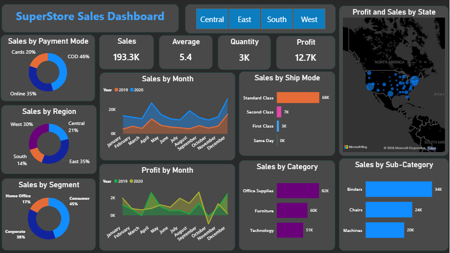

# SuperStore Sales Dashboard | Power BI

## 📌 Project Overview

The SuperStore Sales Dashboard is an interactive Power BI project that analyzes sales, profit, customer segments, shipping modes, payment methods, and regional performance. The dashboard helps business stakeholders monitor key performance indicators and make data-driven decisions to improve sales and profitability.

---

## 🎯 Business Problem

Retail businesses generate large amounts of sales data, making it difficult to identify high-performing products, profitable regions, and customer purchasing patterns. This dashboard provides a comprehensive overview of business performance through interactive visualizations.

---

## 🛠️ Tools & Technologies

- Power BI
- Power Query
- DAX
- Data Modeling

---

## 📊 Dashboard KPIs

| KPI | Value |
|------|-------|
| Total Sales | 193.3K |
| Total Profit | 12.7K |
| Total Quantity Sold | 3K |
| Average Order Value | 5.4 |

---

## 📈 Dashboard Features

- Region-wise Analysis (Central, East, South, West)
- Sales by Payment Mode
- Sales by Region
- Sales by Segment
- Monthly Sales Trend
- Monthly Profit Trend
- Sales by Ship Mode
- Sales by Category
- Sales by Sub-Category
- Profit & Sales by State Map
- Interactive Filters

---

## 🔍 Key Insights

- East region contributes the highest share of sales among all regions.
- Consumer segment generates the largest portion of total sales.
- Cash on Delivery (COD) is the most preferred payment mode.
- Office Supplies is the highest-selling product category.
- Binders and Chairs are the top-performing sub-categories.
- Standard Class is the most frequently used shipping mode.
- Sales and profit show noticeable growth towards the end of the year.

---

## 💡 Business Recommendations

- Increase inventory for high-performing categories and sub-categories.
- Improve marketing efforts in low-performing regions.
- Promote faster shipping options for premium customers.
- Optimize product mix based on regional demand.
- Monitor monthly sales trends to improve forecasting and inventory planning.

---

## 📂 Repository Contents

```
SuperStore-Sales-Dashboard/
│── SuperStore Dashboard.pbix
│── Dashboard.png
│── SuperStore_Data.xlsx
│── README.md
```

---

## 📷 Dashboard Preview



---

## ⭐ Project Outcome

This dashboard enables business managers to track sales performance, monitor profitability, analyze customer purchasing behavior, and identify growth opportunities using interactive Power BI visualizations.
